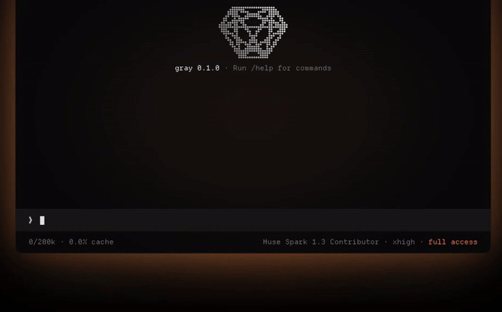

  

# vstaln

### I build [gray](https://github.com/vstaln/gray). Everything else is a footnote.

[gray.alignment.id](https://gray.alignment.id) · [gray on GitHub](https://github.com/vstaln/gray) · [vstal.in](https://vstal.in/) · [LinkedIn](https://www.linkedin.com/in/vstaln/)

  

### magnum opus

**[vstaln/gray](https://github.com/vstaln/gray) — a minimal, modular AI agent harness.**

No bloated agent framework. Tiny core — memory, skills, cron, messaging — you add only what you need. One binary, no runtime. Any OpenAI-compatible provider.

  

`curl -fsSL https://gray.alignment.id/install.sh | sh`

[Website](https://gray.alignment.id) · [Docs](https://github.com/vstaln/gray/tree/main/docs) · [Releases](https://github.com/vstaln/gray/releases)

- one binary, musl-static. lands you in a REPL.
- one tool by default: `bash`. opt into the rest.
- sessions that survive. JSONL, branchable, resumable.
- context that compacts itself before you hit the wall.
- lives where you do: Telegram / Discord / Slack gateway + cron.
- extend it: `SKILL.md`, stdio plugins, or `/acp` to become claude / codex / opencode.

### other experiments

- [noslop](https://github.com/vstaln/noslop) — structure-first writing skill, stops AI slop
- [isthisaislop](https://github.com/vstaln/isthisaislop) — local detector for AI-style prose
- [CalmFeed](https://github.com/vstaln/CalmFeed) — makes X less miserable for builders

  
  
  
  
start small. extend anything.

